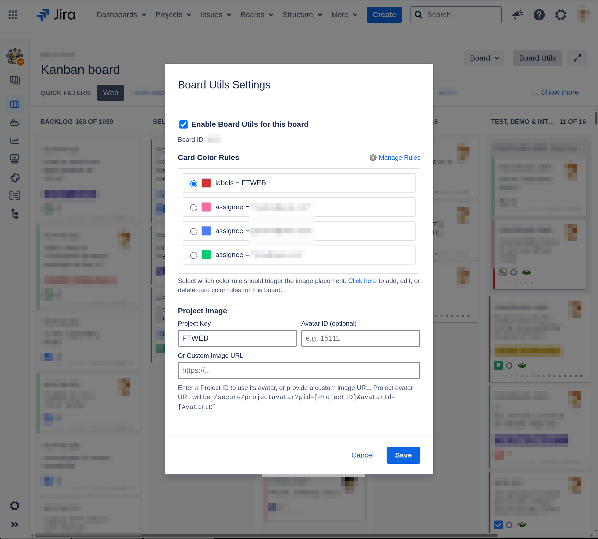
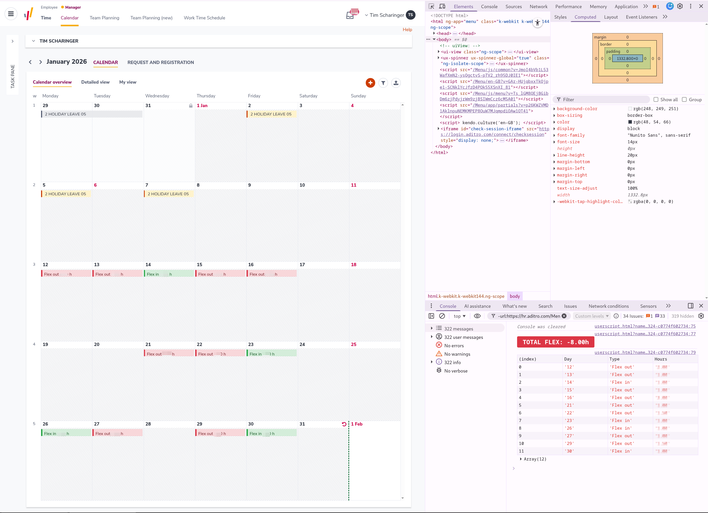

# 🐒 Userscripts by Tim Scharinger

My collection of Tampermonkey scripts.

## 📋 Table of Contents

- [🚀 Installation](#-installation)
- [🌟 Featured Scripts](#-featured-scripts)
  - [🔗 PR-2-Jira: GitHub Jira Link Creator](#-pr-2-jira-github-jira-link-creator)
    - [Features](#features)
    - [How it works](#how-it-works)
    - [Configuration](#configuration)
  - [🎨 Jira Epic Color Picker](#-jira-epic-color-picker)
  - [🛠️ Jira Board Utils](#️-jira-board-utils)
    - [Features](#features-1)
    - [How it works](#how-it-works-1)
  - [🧾 Aditro: HR Calendar Flex Fix](#-aditro-hr-calendar-flex-fix)
- [🛠️ Development](#️-development)
  - [Local Development Server](#local-development-server)
- [💖 Support](#-support)

---

## 🚀 Installation

### 1. Install Tampermonkey

First, install the Tampermonkey browser extension:

- **Chrome/Edge**: [Chrome Web Store](https://chrome.google.com/webstore/detail/tampermonkey/dhdgffkkebhmkfjojejmpbldmpobfkfo)
- **Firefox**: [Firefox Add-ons](https://addons.mozilla.org/en-US/firefox/addon/tampermonkey/)
- **Safari**: [App Store](https://apps.apple.com/us/app/tampermonkey/id6738342400)

**Important:** For Safari users, you'll need to:
1. Enable Developer mode in Safari preferences
2. Allow user scripts in the Tampermonkey extension settings

### 2. Add Scripts

**Method 1: Direct Links (Easiest)**

Copy and paste these direct links:

- **PR-2-Jira Script**: [https://github.com/scharinger/userscripts/raw/refs/heads/main/scripts/pr-2-jira.js](https://github.com/scharinger/userscripts/raw/refs/heads/main/scripts/pr-2-jira.js)
- **Jira Epic Color Picker**: [https://github.com/scharinger/userscripts/raw/refs/heads/main/scripts/jira-epic-color-picker.js](https://github.com/scharinger/userscripts/raw/refs/heads/main/scripts/jira-epic-color-picker.js)
- **Jira Board Utils**: [https://github.com/scharinger/userscripts/raw/refs/heads/main/scripts/board-utils.js](https://github.com/scharinger/userscripts/raw/refs/heads/main/scripts/board-utils.js)

1. Open Tampermonkey utilities: [chrome-extension://dhdgffkkebhmkfjojejmpbldmpobfkfo/options.html#nav=utils](chrome-extension://dhdgffkkebhmkfjojejmpbldmpobfkfo/options.html#nav=utils)
2. Paste any of the above raw URLs into **"Import from URL"** and click **"Install"**

**Method 2: Import from URL**

1. Click on the script file in this repository (e.g., `pr-2-jira.js`)
2. Click the **"Raw"** button and copy the URL from your browser's address bar
3. Open Tampermonkey utilities: `chrome-extension://dhdgffkkebhmkfjojejmpbldmpobfkfo/options.html#nav=utils`
4. Paste the raw URL into **"Import from URL"** and click **"Install"**

**Method 3: Manual Copy/Paste**

1. Click on the script file in this repository (e.g., `pr-2-jira.js`)
2. Click the **"Raw"** button to view the raw script content
3. Copy the entire script content
4. Open Tampermonkey dashboard (click the Tampermonkey icon → Dashboard)
5. Click **"Create a new script"**
6. Replace the default template with the copied script content
7. Press **Ctrl+S** (or Cmd+S on Mac) to save

### 3. Configure Scripts

**For PR-2-Jira script:**
- The default prefix is `"Solves: Jira"`
- To customize, access settings through the Tampermonkey menu: **PR-2-Jira Settings**
- Configure which text patterns should trigger the button placement

---

## 🌟 Featured Scripts

### 🔗 PR-2-Jira: GitHub & Jira Integration

**Description:** A single userscript that seamlessly connects GitHub Pull Requests to Jira issues with smart button placement and automatic remote link creation.

### Features

- **Unified Script**: One installation handles both GitHub and Jira functionality automatically
- **Smart Button Placement**: Adds "📌 Create PR link in Jira" buttons next to Jira links that match your configured prefix (default: "Solves: Jira")
- **Domain Detection**: Automatically detects GitHub and Jira domains to provide the right functionality
- **Configurable Prefix**: Customize which text patterns trigger button placement through the settings menu
- **Automatic Link Creation**: Clicking the button opens the Jira issue and automatically creates a remote link back to the GitHub PR
- **Multiple Issue Support**: Handles PRs that reference multiple Jira issues correctly

### How it works

The script (`pr-2-jira.js`) automatically detects the page type and provides the appropriate functionality:

1. **On GitHub PRs**: Scans for Jira links with your configured prefix and adds buttons
   
   
   _GitHub PR view showing the smart button placement next to Jira links_

2. **On Jira Issues**: Receives PR links and automatically creates remote links in the Jira issue
   
   
   _Jira issue automatically receiving the PR as a remote link (notification toast shows "link already exists" in this example)_

### Configuration

Access settings through by clicking the cogwheel icon. Located next to the "Create PR link in Jira" button or in the bottom left corner.

### 🎨 Jira Epic Color Picker

**Description:** Replaces Jira's fixed epic color options with a proper color picker, giving you full control over epic colors.


### 🛠️ Jira Board Utils

**Description:** Add custom project icons to Jira board cards based on configurable color rules. Perfect for visual project identification and team workflows.



#### Features

- **Multi-Board Support**: Each board maintains its own independent configuration
- **Dynamic Color Rules**: Automatically fetches and displays your board's card color rules from Jira
- **Project-Based Images**: Simply enter a project key (e.g., "FTWEB") to use that project's avatar
- **Smart Configuration**: Choose which color rule triggers image placement with an intuitive interface
- **Automatic Refresh**: Settings are applied instantly without manual page reloads
- **User-Friendly Setup**: Toggle on/off per board with easy-to-use settings dialog

#### How it works

1. **Open Board Settings**: Click the "Board Utils" button in your Jira board toolbar
2. **Enable for Board**: Toggle on "Enable Board Utils for this board"
3. **Choose Color Rule**: Select which card color rule should trigger the image (e.g., `project = "FTWEB"`)
4. **Set Project Image**: Enter your project key (e.g., "FTWEB") to use that project's avatar, or provide a custom image URL
5. **Save & Enjoy**: Settings are saved automatically and applied to matching cards

#### Perfect for:
- **Project Identification**: Quickly identify which project each card belongs to
- **Team Workflows**: Visual indicators for different teams or components  
- **Multi-Project Boards**: Clear separation when working with multiple projects
- **Custom Branding**: Use project avatars or custom images for better visual organization

---

### 🧾 Aditro: HR Calendar Flex Fix

**Description:** Cleans up and highlights flexible working hour entries on Aditro/HR calendar pages. The script normalizes verbose transaction text to a compact `Flex in/out X.XX h`, applies color styling, and prints a small console summary of total flex hours.



- **Script:** `scripts/aditro.js`
- **Match:** `https://hr.aditro.com/*`
- **Features:**
  - Normalizes calendar transaction text to `Flex in` / `Flex out` with hours
  - Applies green/red styling to entries for quick visual scanning
  - Calculates total flex and logs a console table with day/type/hours
  - Runs on a 3s interval to update dynamically loaded content
- **Install:** Add the script via Tampermonkey using the raw URL:
  - https://github.com/scharinger/userscripts/raw/refs/heads/main/scripts/aditro.js


## 🛠️ Development

### Local Development Server

For script development and testing, this repository includes a Vite-based development server that serves your userscripts locally:

```bash
# Install dependencies
bun install

# Start development server
bun dev
```

> **Note:** You can also use `npm` or `yarn` instead of `bun` - all package managers work equally well for this project.

The server will run on `http://localhost:3000` and provides:

- **Live script serving**: Access scripts at `http://localhost:3000/scripts/[script-name].js`
  - `http://localhost:3000/scripts/pr-2-jira.js`
  - `http://localhost:3000/scripts/jira-epic-color-picker.js`
  - `http://localhost:3000/scripts/boardUtils.js`
- **Web interface**: Visit `http://localhost:3000` to see all available scripts with copy-paste URLs
- **Hot reloading**: Changes to scripts are immediately available without server restart
- **CORS enabled**: Ready for Tampermonkey development workflow

#### Using with Tampermonkey Development:

1. Start the dev server with `bun dev`
2. Use the provided auto-refresh wrapper template (`auto-refresh-wrapper.js`)
3. Create a new Tampermonkey script using the template:
   - Replace `[SCRIPT NAME]` with a descriptive name
   - Replace `[ADD YOUR MATCH PATTERNS HERE]` with appropriate @match patterns  
   - Replace `[SCRIPT-FILE-NAME]` with the actual filename
4. Save the wrapper script in Tampermonkey
5. Your script will now reload automatically on every page refresh (no caching issues!)

**The wrapper uses dynamic script injection with timestamps to bypass all caching.**

---

## 💖 Support

If this saves you clicks or makes Jira more pleasant:

- [☕ Buy me a coffee](https://ko-fi.com/scharinger)
- [⭐ Star this repository](https://github.com/scharinger/userscripts)
