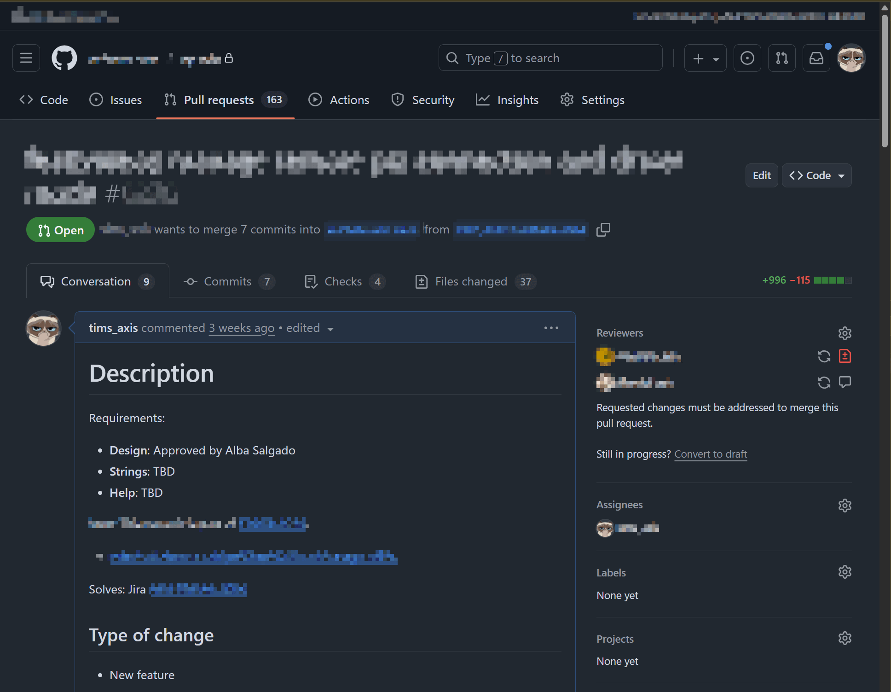
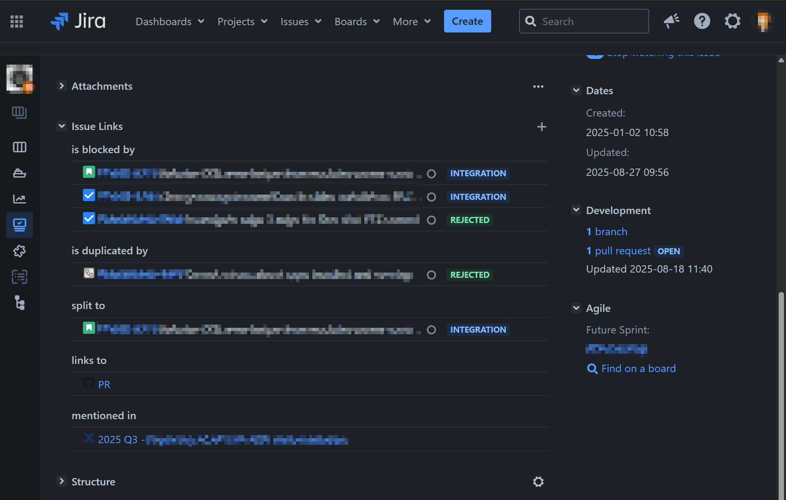
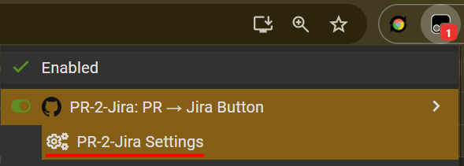
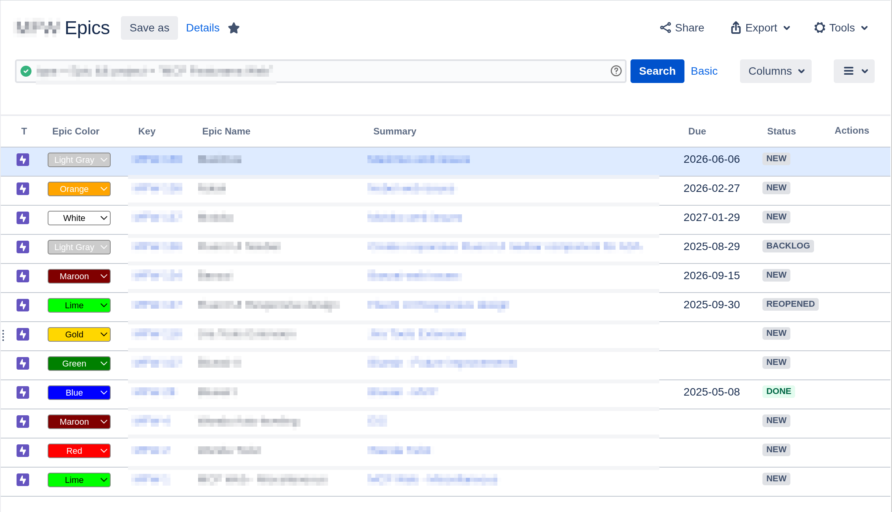

# 🐒 Userscripts by Tim Scharinger

My collection of Tampermonkey scripts.

## 📋 Table of Contents

- [🚀 Installation](#-installation)
- [🌟 Featured Scripts](#-featured-scripts)
  - [🔗 PR-2-Jira: GitHub Jira Link Creator](#-pr-2-jira-github-jira-link-creator)
    - [Features](#features)
    - [How it works](#how-it-works)
    - [Configuration](#configuration)
  - [🎨 Jira Epic Color Picker](#-jira-epic-color-picker)
- [💖 Support](#-support)

---

## 🚀 Installation

### 1. Install Tampermonkey

First, install the Tampermonkey browser extension:

- **Chrome/Edge**: [Chrome Web Store](https://chrome.google.com/webstore/detail/tampermonkey/dhdgffkkebhmkfjojejmpbldmpobfkfo)
- **Firefox**: [Firefox Add-ons](https://addons.mozilla.org/en-US/firefox/addon/tampermonkey/)
- **Safari**: [App Store](https://apps.apple.com/us/app/tampermonkey/id6738342400)

**Important:** For Safari users, you'll need to:
1. Enable Developer mode in Safari preferences
2. Allow user scripts in the Tampermonkey extension settings

### 2. Add Scripts

**Method 1: Import from URL (Recommended)**

1. Click on the script file in this repository (e.g., `pr-2-jira-github.js`)
2. Click the **"Raw"** button and copy the URL from your browser's address bar
3. Open Tampermonkey utilities: `chrome-extension://dhdgffkkebhmkfjojejmpbldmpobfkfo/options.html#nav=utils`
4. Paste the raw URL into **"Import from URL"** and click **"Install"**

**Method 2: Manual Copy/Paste**

1. Click on the script file in this repository (e.g., `pr-2-jira-github.js`)
2. Click the **"Raw"** button to view the raw script content
3. Copy the entire script content
4. Open Tampermonkey dashboard (click the Tampermonkey icon → Dashboard)
5. Click **"Create a new script"**
6. Replace the default template with the copied script content
7. Press **Ctrl+S** (or Cmd+S on Mac) to save

### 3. Configure Scripts

**For PR-2-Jira scripts:**
- The default prefix is `"Solves: Jira"`
- To customize, access settings through the Tampermonkey menu: **PR-2-Jira Settings**
- Configure which text patterns should trigger the button placement

---

## 🌟 Featured Scripts

### 🔗 PR-2-Jira: GitHub Jira Link Creator

**Description:** Seamlessly connect GitHub Pull Requests to Jira issues with smart button placement and automatic remote link creation.

### Features

- **Smart Button Placement**: Adds "📌 Create PR link in Jira" buttons next to Jira links that match your configured prefix (default: "Solves: Jira")
- **Configurable Prefix**: Customize which text patterns trigger button placement through the settings menu
- **Automatic Link Creation**: Clicking the button opens the Jira issue and automatically creates a remote link back to the GitHub PR
- **Multiple Issue Support**: Handles PRs that reference multiple Jira issues correctly

### How it works

1. **GitHub Script** (`pr-2-jira-github.js`): Scans GitHub PRs for Jira links with your configured prefix and adds buttons
   
   
   _GitHub PR view showing the smart button placement next to Jira links_
2. **Jira Script** (`pr-2-jira-jira.js`): Receives the PR link and automatically creates a remote link in the Jira issue
   
   
   _Jira issue automatically receiving the PR as a remote link (notification toast shows "link already exists" in this example)_

### Configuration

Access settings through the Tampermonkey menu: **PR-2-Jira Settings**

### 🎨 Jira Epic Color Picker

**Description:** Replaces Jira's fixed epic color options with a proper color picker, giving you full control over epic colors.

---

## 💖 Support

If this saves you clicks or makes Jira more pleasant:

- [☕ Buy me a coffee](https://ko-fi.com/scharinger)
- [⭐ Star this repository](https://github.com/scharinger/userscripts)
